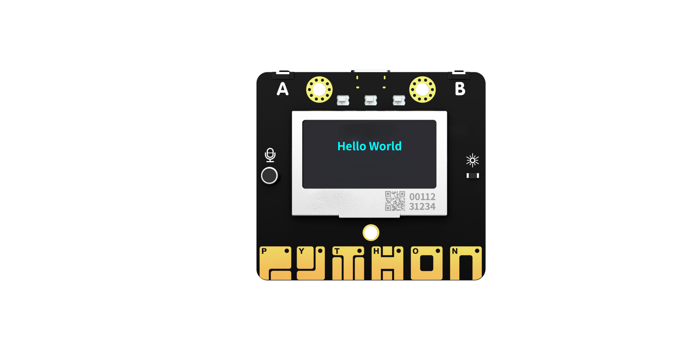

# Homepage

 

The mPython control board is a MicroPython microcontroller board that integrates the ESP32 high-performance dual-core chip and uses the most popular Python programming language so that you can easily transfer code from the computer to the control board and experience the endless fun of program creation!

## Technical Parameters 

The board has the following hardware features: 

ESP-32 master control 
Processor: Tensilica LX6 dual-core processor (one core handles high-speed connections; one core handles independent application development)  
Main frequency: up to 240MHz clock frequency  
SRAM: 520KB  
Flash：8MB  
Wi-Fi standards: FCC/CE/TELEC/KCC  
Wi-Fi protocol: 802.11 b/g/n/d/e/i/k/r (802.11n, speed up to 150 Mbps), A-MPDU and A-MSDU aggregation, support 0.4us guard interval  
Frequency range: 2.4~2.5 GHz  
Bluetooth protocol: Compliant with Bluetooth v4.2 BR/EDR and BLE standards  
Bluetooth audio: CVSD and SBC audio Low power consumption: 10uA  
Power supply mode: USB power supply; external power supply;  
Working voltage: 3.3V  
Maximum operating current: 200mA  
Maximum load current: 1000mA  
Take control of the board  
Three-axis accelerometer MSA300: Measuring range: ±2/4/8/16G;  
Six-axis sensor (v2.1.0 and later): QMI8658C (LGA-14) gyroscope: optional range, up to ±2048°/s Three-axis accelerometer: optional range, up to ±16G;  
Geomagnetic sensor MMC5983MA: Measuring range: ±8G range; accuracy 0.4mGs, electronic compass error ±0.5°;  
Geomagnetic sensor MMC5603NJ (v2.2.0 and later versions): 3-axis, minimum resolution is 0.0625mG, ±30G range, pointing accuracy within ±1°;  
Light sensor: Phototransistor ALS-PT19-315C  
Microphone: EM4013BTC1R16B-T0-423  
3 full-color WS2812-2020 RGB-LED lamp beads  
1.3-inch OLED display, supports 16*16 character display, resolution 128x64  
Passive buzzer SMD-050020F-03040N  
Supports 2 physical buttons (A/B) and 6 touch buttons (P/Y/T/H/O/N)  
Supports 1-way alligator clip interface, which can easily connect to various resistive sensors  

### Expand interface

20 channels of digital I/O, (supporting 12 channels of PWM and 6 channels of touch input) 
5-channel 12-bit analog input ADC, P0~P4  
1-way external input alligator clip interface: EXT/GND  
Support I2C communication protocol  
Support UART communication protocol  
Support SPI communication protocol  